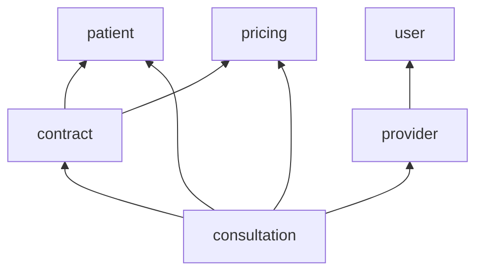

# Sublime Fisioterapia

Sistema de controle de atendimento e repasse de honorários da clínica Sublime
Fisioterapia.

> ⚠️ **Projeto em desenvolvimento**

## Sobre o projeto

O sistema resolve um problema real de uma clínica de fisioterapia: cruzar atendimentos realizados, planos contratados e comissão de cada prestador para calcular corretamente o repasse de honorários, hoje feito manualmente. O objetivo deste sistema é automatizar esse processo de ponta a ponta: do cadastro de pacientes e contratos até o lançamento de atendimentos e o cálculo do repasse devido a cada prestador.

O desenvolvimento está sendo feito por fases, começando pelo cadastro das
entidades de base (pacientes, prestadores, catálogo de preços) para depois
avançar para a camada de negócio mais sensível: o lançamento de atendimentos e
o cálculo financeiro que ele dispara.

## Stack

| Camada | Tecnologia |
|---|---|
| Linguagem / Runtime | Java 25 |
| Framework | Spring Boot 4 |
| Persistência | Spring Data JPA + MySQL |
| Migrations | Flyway |
| Segurança | Spring Security (OAuth2) |
| Documentação de API | Swagger / OpenAPI |
| Frontend (planejado) | ReactJS |

## Arquitetura

O sistema é estruturado como um **monolito modular**, com módulos organizados
em torno das principais entidades de negócio e dependência sempre
unidirecional entre eles:

Essa escolha reflete o estágio e a escala atual do produto: um domínio de
negócio ainda em consolidação, com fronteiras entre áreas (cadastro de
pacientes, precificação, contratos, atendimentos) ainda sendo desenhadas e
ajustadas. Manter tudo em um único deploy reduz a complexidade operacional
dessa fase, enquanto a separação em módulos com dependência controlada
preserva fronteiras de domínio bem definidas desde o início.

Na prática, isso significa que cada área de negócio evolui de forma isolada,
sem acoplamento acidental entre partes que não deveriam se conhecer e, se o
sistema crescer a ponto de justificar, essas fronteiras já modeladas tornam
uma eventual extração para serviços independentes uma decisão de
infraestrutura, não uma reescrita do domínio.

## Status atual

O projeto está na primeira fase, focada em consolidar o cadastro básico do
negócio: pacientes, prestadores, contratos e catálogo de preços já têm suas
regras de domínio definidas e em implementação.

