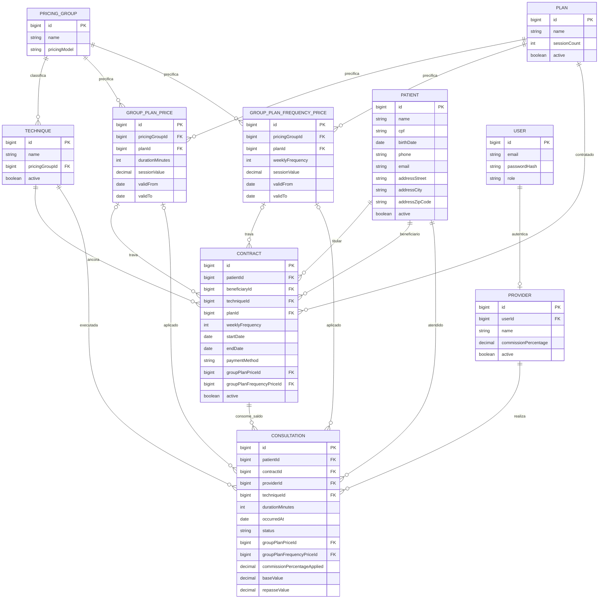

# Modelo de domínio — referência completa

> Consulte este arquivo antes de propor qualquer mudança de schema ou entidade.
> Ele documenta não só a estrutura final, mas o raciocínio por trás de cada
> decisão — várias delas já foram tentadas de outra forma e revertidas por um
> motivo específico, registrado abaixo.

## Diagrama entidade-relacionamento

Legenda: `addressStreet`/`addressCity`/`addressZipCode` em `Patient` são um Value
Object embutido (`@Embeddable`), não uma tabela própria. `pricingModel`, `role`,
`paymentMethod` e `status` são ENUMs. `groupPlanPriceId`/`groupPlanFrequencyPriceId`
(em `Contract` e `Consultation`) são nullable, em padrão "exclusive arc": sempre um
preenchido, nunca os dois.

---

## `Patient`

| Atributo | Tipo | Observação |
|---|---|---|
| `id` | Long | auto-increment |
| `name` | string | |
| `cpf` | string | |
| `birthDate` | date | |
| `phone` | string | |
| `email` | string | |
| `address` | VO embutido (street, city, zipCode) | `@Embeddable`/`@Embedded` |
| `active` | boolean | soft delete |

**Por que endereço é Value Object, não entidade própria:** não existe caso de uso
em que precisamos rastrear a identidade de um endereço ao longo do tempo — trocar
de endereço é substituição de valor, não edição de um registro com vida própria.

**Por que `Patient` não referencia `Contract`:** o relacionamento é sempre
unidirecional `Contract → Patient`. Se `Patient` tivesse uma coleção de contratos,
o módulo `patient` passaria a depender do módulo `contract`, criando ciclo (já que
o inverso é verdadeiro por natureza).

---

## `Technique`

| Atributo | Tipo | Observação |
|---|---|---|
| `id` | Long | auto-increment |
| `name` | string | |
| `pricingGroupId` | FK → PricingGroup | |
| `active` | boolean | |

**Por que sem preço nem duração:** técnicas do mesmo grupo de precificação (ex:
Miofascial, RPG, Massoterapia, Pilates Individual — mesmo grau de complexidade
COFFITO) compartilham exatamente o mesmo valor. Guardar preço na técnica geraria
duplicação replicada em cada reajuste, com risco de divergência silenciosa.

---

## `Plan`

| Atributo | Tipo | Observação |
|---|---|---|
| `id` | Long | auto-increment |
| `name` | string | |
| `sessionCount` | int | quantidade de sessões do pacote |
| `active` | boolean | |

**Por que sem frequência semanal, vigência ou desconto:** um paciente pode
contratar um plano Anual (52 sessões) com vigência de 6 meses a 2x/semana — a
mesma quantidade de sessões pode ser consumida em ritmos diferentes. Frequência e
vigência são decisão de negociação, vivem em `Contract`. Desconto é sempre
calculado em tempo de leitura (ver seção de preço abaixo), nunca armazenado.

---

## `PricingGroup`

| Atributo | Tipo | Observação |
|---|---|---|
| `id` | Long | auto-increment |
| `name` | string | |
| `pricingModel` | ENUM: `DURATION_BASED` \| `FREQUENCY_BASED` | discriminador |

**Por que existe:** técnicas de mesmo grau de complexidade COFFITO compartilham
uma única tabela de preço. O grupo é quem carrega o preço; a técnica só aponta
para o grupo. Reajustar o valor do grupo atualiza automaticamente todas as
técnicas associadas, sem precisar editar cada uma.

**Por que o discriminador `pricingModel`:** a maioria dos grupos precifica por
`duração da sessão × plano` (`DURATION_BASED`). O Grupo Pilates precifica por
`frequência semanal × plano` (`FREQUENCY_BASED`) — o preço por sessão não é uma
multiplicação simples do valor unitário, é uma tabela de desconto por volume
publicada à parte (embute cálculo de feriados). As duas estratégias não cabem na
mesma tabela sem colunas nulas para a maioria das linhas, por isso duas tabelas
de preço separadas (abaixo).

---

## `GroupPlanPrice` (grupos `DURATION_BASED`)

| Atributo | Tipo | Observação |
|---|---|---|
| `id` | Long | auto-increment |
| `pricingGroupId` | FK → PricingGroup | |
| `planId` | FK → Plan | |
| `durationMinutes` | int | eixo de duração |
| `sessionValue` | decimal | |
| `validFrom` | date | |
| `validTo` | date, nullable | `null` = vigente |

## `GroupPlanFrequencyPrice` (grupos `FREQUENCY_BASED`)

| Atributo | Tipo | Observação |
|---|---|---|
| `id` | Long | auto-increment |
| `pricingGroupId` | FK → PricingGroup | |
| `planId` | FK → Plan | |
| `weeklyFrequency` | int | eixo de frequência |
| `sessionValue` | decimal | |
| `validFrom` | date | |
| `validTo` | date, nullable | `null` = vigente |

**Regra de unicidade:** só pode existir uma linha com `validTo IS NULL` por
combinação de `(pricingGroupId, durationMinutes, planId)` — ou
`(pricingGroupId, weeklyFrequency, planId)` na tabela de frequência.

**Reajuste nunca é `UPDATE`.** Sempre: fecha a linha vigente (`validTo` = ontem) e
insere uma nova com `validFrom` = hoje. Isso preserva o histórico completo de
preços — requisito de rastreabilidade do escopo original do projeto — e garante
que contratos antigos continuem apontando para o valor que estava vigente na
assinatura.

**Percentual de desconto nunca é persistido.** É sempre calculado em tempo de
leitura: `1 − (valorDoPlano / valorDeReferência)`, onde a referência é o Avulso da
mesma técnica/grupo quando existir, ou o Mensal quando não existir Avulso (caso do
Grupo Pilates). Guardar os dois campos (valor absoluto e percentual) gera risco de
dessincronia a cada reajuste.

---

## `Contract`

| Atributo | Tipo | Observação |
|---|---|---|
| `id` | Long | auto-increment |
| `patientId` | FK → Patient | titular, obrigatório |
| `beneficiaryId` | FK → Patient, nullable | Pilates em Dupla / plano Familiar |
| `techniqueId` | FK → Technique | técnica-âncora (define com base em qual valor o contrato foi fechado) |
| `planId` | FK → Plan | |
| `weeklyFrequency` | int | decisão de negociação, independente do preço |
| `startDate` / `endDate` | date | vigência negociada |
| `paymentMethod` | ENUM | |
| `groupPlanPriceId` | FK → GroupPlanPrice, nullable | exclusive arc |
| `groupPlanFrequencyPriceId` | FK → GroupPlanFrequencyPrice, nullable | exclusive arc |
| `active` | boolean | |

**Sobre `beneficiaryId`:** cobre tanto o Pilates em Dupla (titular + acompanhante
compartilhando o mesmo saldo) quanto os planos Familiares (dois contratos
distintos, cada um com seu próprio titular e beneficiário — o grau de parentesco
entre os titulares é checado manualmente pela clínica na venda, o sistema não
guarda nem valida isso).

**Sobre `techniqueId` ser só "âncora":** o paciente não fica restrito a essa
técnica. `techniqueId` formaliza com base em qual valor o contrato foi
inicialmente fechado; o paciente pode usar qualquer técnica do seu plano
livremente (ver lógica de resolução de preço em `Consultation`, abaixo). Um
paciente tem apenas um contrato vigente em seu nome.

**Sobre as duas FKs de preço:** o contrato trava, no momento da assinatura, a
linha de preço vigente naquele instante — mesmo que o catálogo seja reajustado
depois, o contrato mantém o valor combinado até o fim da vigência. Constraint de
banco (`CHECK`) garante que exatamente uma das duas FKs esteja preenchida.

---

## `User`

| Atributo | Tipo | Observação |
|---|---|---|
| `id` | Long | auto-increment |
| `email` | string | |
| `passwordHash` | string | |
| `role` | ENUM: `ADMIN` \| `PROVIDER` | |

**Por que separado de `Provider`:** autenticação é preocupação genérica; dado de
negócio (percentual de repasse) é específico da clínica. Misturar os dois
acoplaria o módulo de login a regras que não são dele.

---

## `Provider`

| Atributo | Tipo | Observação |
|---|---|---|
| `id` | Long | auto-increment |
| `userId` | FK → User | |
| `name` | string | |
| `commissionPercentage` | decimal | uniforme, não varia por técnica |
| `active` | boolean | |

**Sobre `commissionPercentage`:** o percentual de repasse é o mesmo para
qualquer atendimento do prestador, independente da técnica. Pode mudar ao longo
do tempo com `UPDATE` simples — não precisa de historização própria, porque cada
`Consultation` já grava o valor aplicado no momento do lançamento
(`commissionPercentageApplied`).

---

## `Consultation`

| Atributo | Tipo | Observação |
|---|---|---|
| `id` | Long | auto-increment |
| `patientId` | FK → Patient | quem foi atendido (pode divergir do titular do contrato) |
| `contractId` | FK → Contract | de quem sai o saldo |
| `providerId` | FK → Provider | quem atendeu |
| `techniqueId` | FK → Technique | técnica clinicamente executada |
| `durationMinutes` | int | dado de agenda; só participa do cálculo se o grupo for `DURATION_BASED` |
| `occurredAt` | date | (não usar `date` como nome de campo — ambíguo com o tipo em alguns parsers) |
| `status` | ENUM: `ATTENDED` \| `NO_SHOW` \| `CANCELLED_EARLY` \| `CANCELLED_WITH_CHARGE` | |
| `groupPlanPriceId` | FK → GroupPlanPrice, nullable | exclusive arc |
| `groupPlanFrequencyPriceId` | FK → GroupPlanFrequencyPrice, nullable | exclusive arc |
| `commissionPercentageApplied` | decimal | snapshot |
| `baseValue` | decimal | snapshot |
| `repasseValue` | decimal | snapshot |

**Por que `patientId` e `contractId` são dois campos separados:** no Pilates em
Dupla, quando o titular não comparece, o prestador pode lançar o atendimento no
nome do acompanhante — quem foi atendido (`patientId`) e de quem sai o saldo
(`contractId`, e por ele, o titular) são pessoas diferentes.

**Por que `techniqueId` é campo próprio, mesmo já existindo a FK de preço:** a
linha de preço aponta para o *grupo*, não para a técnica específica. Sem esse
campo, perderíamos a granularidade necessária para relatórios como "atendimentos
de Quiropraxia este mês".

**Por que os três valores (`baseValue`, `commissionPercentageApplied`,
`repasseValue`) são sempre gravados, nunca só derivados:** eles representam uma
obrigação financeira já consumada, que entra direto nos honorários do prestador
assim que lançada (sem fluxo de aprovação). Um reajuste futuro no catálogo de
preço, ou uma mudança na comissão do prestador, nunca deve alterar
retroativamente o valor de um atendimento já lançado.

**Por que `status` não tem uma coluna extra de "conta para o repasse":** é uma
regra fixa por valor (`ATTENDED`, `NO_SHOW` e `CANCELLED_WITH_CHARGE` contam;
`CANCELLED_EARLY` não conta), então vive como método no enum
(`status.countsTowardsBilling()`), não como dado replicado no banco.

### Lógica de resolução de preço no lançamento

1. Prestador seleciona paciente, duração, técnica e status.
2. Sistema compara `technique.pricingGroupId` do atendimento com o do contrato
   do paciente.
   - **Mesmo grupo:** usa o `planId` do próprio `Contract` automaticamente.
   - **Grupo diferente:** abre um modal para o prestador escolher manualmente o
     plano equivalente no grupo da nova técnica (ex: Avulso, 6 sessões, 12
     sessões, para Quiropraxia). *Decisão atual: escolha livre do prestador, sem
     validação da clínica — trava/validação é melhoria futura.*
3. Busca o preço vigente na tabela correta (`GroupPlanPrice` se
   `DURATION_BASED`, `GroupPlanFrequencyPrice` se `FREQUENCY_BASED`).
4. Grava o snapshot: `baseValue`, `commissionPercentageApplied`, `repasseValue`.

**Nota:** o preço travado em `Contract` é uma referência de cobrança, não
necessariamente o valor de toda sessão futura — se a duração real ou a técnica
divergirem do que o contrato ancora, o valor daquele atendimento específico é
resolvido de novo, seguindo o fluxo acima.

---

## Não modelado ainda (fora do escopo da Fase 1)

- **`Payment`** — controle financeiro/saldo do paciente (pagamentos realizados x
  valor consumido nos atendimentos `countsTowardsBilling`). Alimenta a visão da
  clínica na Fase 2.
- App de consulta de saldo do paciente (Fase 3) — camada de consumo somente
  leitura sobre `consultation` e `payment`, sem entidades novas.
