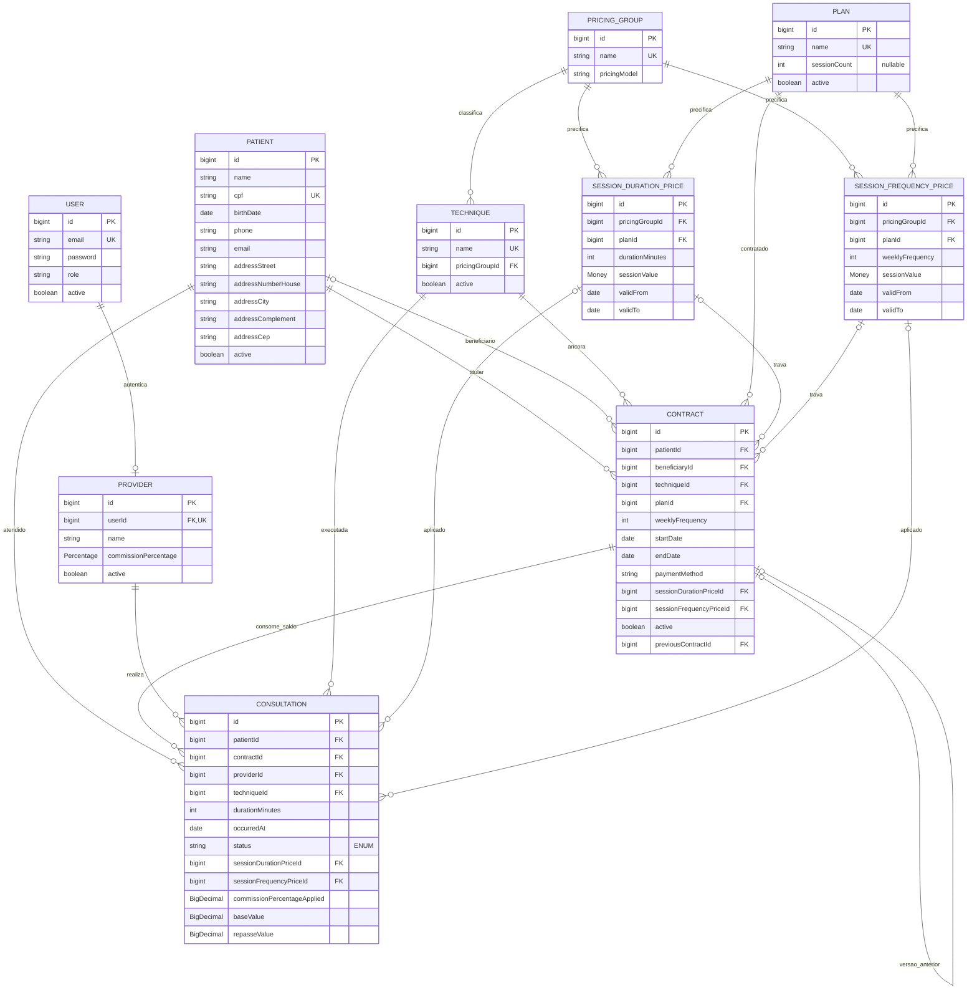

# Modelo de domínio — referência completa

> Consulte este arquivo antes de propor qualquer mudança de schema ou entidade.
> Ele documenta não só a estrutura final, mas o raciocínio por trás de cada
> decisão — várias delas já foram tentadas de outra forma e revertidas por um
> motivo específico, registrado abaixo.

## Diagrama entidade-relacionamento

```mermaid
erDiagram
  PRICING_GROUP ||--o{ TECHNIQUE : classifica
  PRICING_GROUP ||--o{ SESSION_DURATION_PRICE : precifica
  PRICING_GROUP ||--o{ SESSION_FREQUENCY_PRICE : precifica
  PLAN ||--o{ SESSION_DURATION_PRICE : precifica
  PLAN ||--o{ SESSION_FREQUENCY_PRICE : precifica
  CONTRACT |o--o| CONTRACT : versao_anterior
  PATIENT ||--o{ CONTRACT : titular
  PATIENT |o--o{ CONTRACT : beneficiario
  TECHNIQUE ||--o{ CONTRACT : ancora
  PLAN ||--o{ CONTRACT : contratado
  SESSION_DURATION_PRICE |o--o{ CONTRACT : trava
  SESSION_FREQUENCY_PRICE |o--o{ CONTRACT : trava
  USER ||--o| PROVIDER : autentica
  PATIENT ||--o{ CONSULTATION : atendido
  CONTRACT ||--o{ CONSULTATION : consome_saldo
  PROVIDER ||--o{ CONSULTATION : realiza
  TECHNIQUE ||--o{ CONSULTATION : executada
  SESSION_DURATION_PRICE |o--o{ CONSULTATION : aplicado
  SESSION_FREQUENCY_PRICE |o--o{ CONSULTATION : aplicado

  PATIENT {
    bigint id PK
    string name
    string cpf UK
    date birthDate
    string phone
    string email
    string addressStreet
    string addressNumberHouse
    string addressCity
    string addressComplement
    string addressCep
    boolean active
  }

  TECHNIQUE {
    bigint id PK
    string name UK
    bigint pricingGroupId FK
    boolean active
  }

  PLAN {
    bigint id PK
    string name UK
    int sessionCount "nullable"
    boolean active
  }

  PRICING_GROUP {
    bigint id PK
    string name UK
    string pricingModel
  }

  SESSION_DURATION_PRICE {
    bigint id PK
    bigint pricingGroupId FK
    bigint planId FK
    int durationMinutes
    Money sessionValue
    date validFrom
    date validTo
  }

  SESSION_FREQUENCY_PRICE {
    bigint id PK
    bigint pricingGroupId FK
    bigint planId FK
    int weeklyFrequency
    Money sessionValue
    date validFrom
    date validTo
  }

  CONTRACT {
    bigint id PK
    bigint patientId FK
    bigint beneficiaryId FK
    bigint techniqueId FK
    bigint planId FK
    int weeklyFrequency
    date startDate
    date endDate
    string paymentMethod
    bigint sessionDurationPriceId FK
    bigint sessionFrequencyPriceId FK
    boolean active
    bigint previousContractId FK
  }

  USER {
    bigint id PK
    string email UK
    string password
    string role
    boolean active
  }

  PROVIDER {
    bigint id PK
    bigint userId FK, UK
    string name
    Percentage commissionPercentage
    boolean active
  }

  CONSULTATION {
    bigint id PK
    bigint patientId FK
    bigint contractId FK
    bigint providerId FK
    bigint techniqueId FK
    int durationMinutes
    date occurredAt
    string status "ENUM"
    bigint sessionDurationPriceId FK
    bigint sessionFrequencyPriceId FK
    BigDecimal commissionPercentageApplied
    BigDecimal baseValue
    BigDecimal repasseValue
  }
```

Legenda: `addressStreet`/`addressNumberHouse`/`addressCity`/`addressComplement`/
`addressCep` em `Patient` são um Value Object embutido (`@Embeddable`), não uma
tabela própria (`cep`, não `zipCode` — é um conceito específico do endereçamento
brasileiro, não uma tradução literal de "zip code"). `pricingModel`, `role`,
`paymentMethod` e `status` são ENUMs. `sessionDurationPriceId`/`sessionFrequencyPriceId`
(em `Contract` e `Consultation`) são nullable, em padrão "exclusive arc": sempre um
preenchido, nunca os dois. `Money` e `Percentage` são Value Objects persistidos como
`DECIMAL` por `AttributeConverter` (ver `SessionDurationPrice` e `Provider`). `UK` =
coluna `unique`. Os valores de `Consultation` ainda são `BigDecimal`: passam a
`Money`/`Percentage` no redesenho do módulo.

**Unicidade de nome e CPF:** nome de `PricingGroup`, `Technique` e `Plan`, CPF de
`Patient` e e-mail de `User` são únicos. A garantia real é o `unique` da coluna; o
service checa antes (`existsBy...`) só para devolver um 409 com mensagem clara. A
collation padrão do MySQL ignora maiúsculas e acentos na comparação, então
"Essencial" e "essencial" contam como o mesmo nome.

---

## `Patient`

| Atributo | Tipo | Observação |
|---|---|---|
| `id` | Long | auto-increment |
| `name` | string | obrigatório |
| `cpf` | string, unique | obrigatório; só os 11 dígitos, sem pontuação |
| `birthDate` | date | obrigatório; não pode ser futura |
| `phone` | string, nullable | opcional |
| `email` | string, nullable | opcional; formato validado quando informado |
| `address` | VO embutido (street, numberHouse, city, complement, cep), nullable | `@Embeddable`/`@Embedded`, imutável (sem setter); opcional |
| `active` | boolean | soft delete |

**Por que endereço é Value Object, não entidade própria:** não existe caso de uso
em que precisamos rastrear a identidade de um endereço ao longo do tempo — trocar
de endereço é substituição de valor, não edição de um registro com vida própria.

**Regras do endereço:** o endereço como um todo é opcional, mas quando informado
precisa estar completo — `street`, `numberHouse`, `city` e `cep` obrigatórios;
só `complement` é opcional. `cep` com exatamente 8 dígitos, sem hífen (mesmo
formato do CPF: só dígitos). `numberHouse` é texto livre para aceitar "S/N". A
regra fica no construtor do próprio `Address` (vale para qualquer caminho) e é
repetida no `AddressDTO` para os erros saírem junto com os demais campos.

**Atualização (`PUT`):** dados pessoais e de contato são substituídos pelo que vier
no request (`phone`/`email` nulos apagam o valor). O endereço é a exceção: `address`
nulo **mantém** o endereço atual; preenchido, substitui o atual por inteiro (é um
Value Object — não dá para mandar só o `cep`). *Consequência aceita: não existe
caminho para remover um endereço depois de cadastrado.*

**Por que `Patient` não referencia `Contract`:** o relacionamento é sempre
unidirecional `Contract → Patient`. Se `Patient` tivesse uma coleção de contratos,
o módulo `patient` passaria a depender do módulo `contract`, criando ciclo (já que
o inverso é verdadeiro por natureza).

---

## `Technique`

| Atributo | Tipo | Observação |
|---|---|---|
| `id` | Long | auto-increment |
| `name` | string, unique | |
| `pricingGroupId` | FK → PricingGroup | fixo após a criação |
| `active` | boolean | soft delete |

**Técnica não muda de grupo:** o grupo define a tabela de preço da técnica, e
contratos e atendimentos já foram fechados com base nele. Reclassificar uma
técnica é cadastrar uma técnica nova no grupo certo e inativar a antiga — os
registros antigos continuam apontando para a técnica com o grupo de então.

**Por que sem preço nem duração:** técnicas do mesmo grupo de precificação (ex:
Miofascial, RPG, Massoterapia, Pilates Individual — mesmo grau de complexidade
COFFITO) compartilham exatamente o mesmo valor. Guardar preço na técnica geraria
duplicação replicada em cada reajuste, com risco de divergência silenciosa.

---

## `Plan`

| Atributo | Tipo | Observação |
|---|---|---|
| `id` | Long | auto-increment |
| `name` | string, unique | |
| `sessionCount` | int, nullable | quantidade de sessões do pacote; `null` nos planos do Pilates em Grupo |
| `active` | boolean | |

**Planos atuais da clínica:**

| Plano | `sessionCount` | Usado em |
|---|---|---|
| Avulso | 1 | grupos `DURATION_BASED` |
| Essencial | 4 | grupos `DURATION_BASED` |
| Evolução | 12 | grupos `DURATION_BASED` |
| Evolução Familiar | 12 | Individual Padrão (por enquanto; os demais grupos depois) |
| Transformação / Transformação Familiar | 26 | grupos `DURATION_BASED` |
| Vitalidade / Vitalidade Familiar | 52 | grupos `DURATION_BASED` |
| Mensal, Trimestral, Semestral, Semestral Familiar, Anual, Anual Familiar | `null` | Em Grupo (`FREQUENCY_BASED`) |

**Por que `sessionCount` é nullable:** no Pilates em Grupo o plano não é um
pacote de sessões, e sim um valor mensal definido pelo plano e pela frequência
semanal (ex: Mensal 1x/semana = 4 aulas no mês, 3x/semana = 12). Gravar um número
fixo seria um dado enganoso, que uma tela ou relatório poderia usar errado. O
plano não sabe em qual grupo é usado (a ligação é a linha de preço), então a regra
"preço por duração exige plano com `sessionCount`" é validada na criação da linha
de preço por duração (que recebe o plano), não no próprio plano.

**Por que o Grupo mantém planos com nomes próprios:** é outro conceito de plano
(mensalidade por frequência, não pacote de sessões), por isso não compartilha os
planos dos grupos por duração.

**Por que sem frequência semanal, vigência ou desconto:** um paciente pode
contratar um plano Vitalidade (52 sessões) com vigência de 6 meses a 2x/semana — a
mesma quantidade de sessões pode ser consumida em ritmos diferentes. Frequência e
vigência são decisão de negociação, vivem em `Contract`. Desconto é sempre
calculado em tempo de leitura (ver seção de preço abaixo), nunca armazenado.

---

## `PricingGroup`

| Atributo | Tipo | Observação |
|---|---|---|
| `id` | Long | auto-increment |
| `name` | string, unique | |
| `pricingModel` | ENUM: `DURATION_BASED` \| `FREQUENCY_BASED` | discriminador; fixo após a criação |

**Por que existe:** técnicas de mesmo grau de complexidade COFFITO compartilham
uma única tabela de preço. O grupo é quem carrega o preço; a técnica só aponta
para o grupo. Reajustar o valor do grupo atualiza automaticamente todas as
técnicas associadas, sem precisar editar cada uma.

**Grupos atuais da clínica:**

| Grupo | Técnicas | `pricingModel` | Tabela de preço |
|---|---|---|---|
| Individual Padrão | Liberação Miofascial, RPG, Massoterapia, Pilates Individual | `DURATION_BASED` | `SessionDurationPrice` |
| Individual Especializado | Quiropraxia, Reabilitação Vestibular | `DURATION_BASED` | `SessionDurationPrice` |
| Em Dupla | Pilates em Dupla | `DURATION_BASED` | `SessionDurationPrice` |
| Em Grupo | Pilates em Grupo | `FREQUENCY_BASED` | `SessionFrequencyPrice` |

**Por que esses nomes:** o grupo representa um conjunto de técnicas com o mesmo
preço, então o nome diz *por que* elas custam igual, e não repete o nome de uma
técnica (o que confundia grupo e técnica em telas e relatórios — ex: "Quiropraxia"
era tanto o grupo quanto uma de suas técnicas). Dois fatores definem o preço: o
**formato do atendimento** (individual, dupla, grupo) e, no individual, o **nível
de especialização** (padrão × especializado, ligado ao grau de complexidade
COFFITO). Uma técnica nova com o mesmo preço entra no grupo correspondente (ex:
um futuro "RPG em dupla" com o preço da dupla entraria em "Em Dupla").

Grupos com uma única técnica (Em Dupla, Em Grupo) são válidos: o grupo existe
porque carrega uma tabela de preço própria. Note que "Pilates" aparece em três
grupos diferentes — Pilates Individual é precificado no Individual Padrão, e só o
Pilates em Grupo é por frequência.

**Por que o discriminador `pricingModel`:** a maioria dos grupos precifica por
`duração da sessão × plano` (`DURATION_BASED`). O Pilates em Grupo precifica por
`frequência semanal × plano` (`FREQUENCY_BASED`) — o preço por sessão não é uma
multiplicação simples do valor unitário, é uma tabela de desconto por volume
publicada à parte (embute cálculo de feriados). As duas estratégias não cabem na
mesma tabela sem colunas nulas para a maioria das linhas, por isso duas tabelas
de preço separadas (abaixo).

**`pricingModel` nunca muda:** as linhas de preço do grupo já estão na tabela
correspondente a ele. Trocar o discriminador deixaria essas linhas (e os contratos
que as travaram) na tabela errada. Um grupo com outro modelo de preço é um grupo
novo.

---

## `SessionDurationPrice` (grupos `DURATION_BASED`)

| Atributo | Tipo | Observação |
|---|---|---|
| `id` | Long | auto-increment |
| `pricingGroupId` | FK → PricingGroup | |
| `planId` | FK → Plan | |
| `durationMinutes` | int | eixo de duração |
| `sessionValue` | `Money` (VO) | coluna `DECIMAL(10,2)` via `MoneyConverter` |
| `validFrom` | date | |
| `validTo` | date, nullable | `null` = vigente; **exclusivo** (ver convenção abaixo) |

## `SessionFrequencyPrice` (grupos `FREQUENCY_BASED`)

| Atributo | Tipo | Observação |
|---|---|---|
| `id` | Long | auto-increment |
| `pricingGroupId` | FK → PricingGroup | |
| `planId` | FK → Plan | |
| `weeklyFrequency` | int | eixo de frequência |
| `sessionValue` | `Money` (VO) | coluna `DECIMAL(10,2)` via `MoneyConverter` |
| `validFrom` | date | |
| `validTo` | date, nullable | `null` = vigente; **exclusivo** (ver convenção abaixo) |

**Valor em dinheiro (`Money`):** `sessionValue` é o Value Object `Money`
(módulo `pricing`), não um `BigDecimal` solto. Regras do próprio `Money`:
obrigatório, nunca negativo, no máximo 2 casas decimais e escala sempre
normalizada em 2 (`220` vira `220.00`). Valor com mais de 2 casas (ex: `220.555`)
é **rejeitado (400), nunca arredondado** — arredondar em silêncio esconderia um
valor digitado errado. Zero é um `Money` válido; "maior que zero" é regra da
linha de preço (`Money.isPositive()`), não do dinheiro em si. O modo de
arredondamento do cálculo de repasse ainda não foi decidido (entra com o
`Consultation`).

**Regra de unicidade:** só pode existir uma linha com `validTo IS NULL` por
combinação de `(pricingGroupId, durationMinutes, planId)` — ou
`(pricingGroupId, weeklyFrequency, planId)` na tabela de frequência.

**Reajuste nunca é `UPDATE`.** Sempre: fecha a linha vigente (`validTo` = hoje) e
insere uma nova com `validFrom` = hoje. Isso preserva o histórico completo de
preços — requisito de rastreabilidade do escopo original do projeto — e garante
que contratos antigos continuem apontando para o valor que estava vigente na
assinatura.

**Convenção de datas: `validTo` é exclusivo.** A vigência de uma linha de preço é
o intervalo semiaberto `[validFrom, validTo)`: a linha vale a partir de
`validFrom` (inclusive) até o dia **anterior** a `validTo`. Ex: `validFrom =
01/10`, `validTo = 15/10` → valeu de 01/10 a 14/10; em 15/10 já vale a linha nova.
- Por que: a linha antiga fecha e a nova abre na **mesma data**, sem a conta do
  "ontem" e sem dois preços valendo no mesmo dia.
- Dois reajustes no mesmo dia geram uma linha com intervalo vazio
  (`[15/10, 15/10)`): ela foi substituída no mesmo dia e não vale em nenhum dia.
  Não é um estado inválido — se um contrato a travou nesse meio-tempo, continua
  com ela, como em qualquer reajuste. Por isso não há bloqueio de reajuste no
  mesmo dia (corrigir um valor digitado errado é só cadastrar de novo).
- Consulta "preço vigente na data X": `validFrom <= X AND (validTo IS NULL OR
  validTo > X)` — **`>`, nunca `>=`**.
- ⚠️ **Diferente do `endDate` de `Contract`, que é inclusivo** (o último dia
  ainda conta). O `endDate` é o "último dia" combinado com o paciente; o
  `validTo` é o momento de troca de preço. Atenção ao comparar os dois.

**Cadastro de valor (novo preço ou reajuste):** um único fluxo cobre os dois
casos — para a clínica, ambos significam "a partir de hoje, essa combinação custa
X". A clínica informa grupo, plano, eixo (duração ou frequência) e valor:
- **sem linha vigente** para a combinação → cria a linha com `validFrom` = hoje;
- **com linha vigente** → fecha a atual (`validTo` = hoje) e cria a nova com
  `validFrom` = hoje.

`validFrom` é sempre hoje, nunca vem do request: como vigente = `validTo` nulo,
uma linha com início futuro já contaria como vigente antes da hora. Reajuste
agendado fica como melhoria futura.

Validações do cadastro: o `pricingModel` do grupo corresponde à tabela usada
(preço por duração só em grupo `DURATION_BASED`, por frequência só em
`FREQUENCY_BASED`); o plano está ativo; preço por duração exige plano com
`sessionCount` preenchido; valor maior que zero.

**Percentual de desconto nunca é persistido.** É sempre calculado em tempo de
leitura: `1 − (valorDoPlano / valorDeReferência)`, onde a referência é o Avulso da
mesma técnica/grupo quando existir, ou o Mensal quando não existir Avulso (caso do
grupo Em Grupo). Guardar os dois campos (valor absoluto e percentual) gera risco de
dessincronia a cada reajuste.

---

## `Contract`

| Atributo | Tipo | Observação |
|---|---|---|
| `id` | Long | auto-increment |
| `patientId` | FK → Patient | titular, obrigatório |
| `beneficiaryId` | FK → Patient, nullable | Pilates em Dupla / plano Familiar |
| `techniqueId` | FK → Technique | técnica-âncora (define com base em qual valor o contrato foi fechado) |
| `planId` | FK → Plan | copiado da linha de preço travada, nunca recebido do request |
| `weeklyFrequency` | int | preço por duração: negociação, informada no request; preço por frequência: copiada da linha de preço |
| `startDate` / `endDate` | date | vigência negociada |
| `paymentMethod` | ENUM | |
| `sessionDurationPriceId` | FK → SessionDurationPrice, nullable | exclusive arc |
| `sessionFrequencyPriceId` | FK → SessionFrequencyPrice, nullable | exclusive arc |
| `active` | boolean | |
| `previousContractId` | FK → Contract, nullable, unique | versão anterior (aditivo); null na primeira versão |

**Sobre `beneficiaryId`:** cobre tanto o Pilates em Dupla (titular + acompanhante
compartilhando o mesmo saldo) quanto os planos Familiares (dois contratos
distintos, cada um com seu próprio titular e beneficiário — o grau de parentesco
entre os titulares é checado manualmente pela clínica na venda, o sistema não
guarda nem valida isso).

- **Beneficiário não é obrigatório, nem no Pilates em Dupla:** nada impede o
  paciente de contratar a dupla e usar sozinho. O sistema não exige nem proíbe
  beneficiário em nenhum plano.
- **Um paciente pode ser beneficiário e titular ao mesmo tempo:** ser beneficiário
  de um contrato não impede de ser titular de outro (nem beneficiário de mais de
  um). Só o titular está sujeito à regra de um contrato vigente. Decisão atual,
  revisável se surgir necessidade.

**Sobre `techniqueId` ser só "âncora":** o paciente não fica restrito a essa
técnica. `techniqueId` formaliza com base em qual valor o contrato foi
inicialmente fechado; o paciente pode usar qualquer técnica do seu plano
livremente (ver lógica de resolução de preço em `Consultation`, abaixo). Um
paciente tem apenas um contrato vigente em seu nome.

**"Ativo" × "vigente":** `active` é o soft delete; vigente é `active = true` **e**
`endDate >= hoje` (o último dia ainda conta — `endDate` é **inclusivo**,
diferente do `validTo` das linhas de preço, que é exclusivo). Só um contrato vigente bloqueia a
criação de outro. Um contrato ativo porém vencido não bloqueia: ele aguarda a
decisão do administrador (prorrogar via aditivo, ou encerrar e levar as sessões
restantes para o contrato seguinte — regra a detalhar junto com o saldo, em
`Consultation`). Por isso um paciente pode ter, temporariamente, mais de um
contrato ativo.

**Cadastros inativos:** paciente titular, beneficiário e técnica precisam estar
ativos para um contrato novo. A vigência exige `endDate >= startDate`.

**Versionamento (aditivos):** o contrato nunca é editado no lugar. Cada
alteração gera uma **nova versão** — novo registro com `previousContractId`
apontando para a versão atual, que é inativada (`POST /api/contracts/{id}/amendments`).
Motivo: o contrato é um compromisso assinado; cada versão será impressa para nova
assinatura, e o histórico completo precisa ser preservado (mesma lógica da
historização de preços). Regras:
- O request traz o **estado completo** da nova versão (o frontend abre o
  formulário preenchido com a versão atual). Nova versão passa pelas mesmas
  regras da criação.
- O **titular nunca muda** (é copiado): trocar o titular é um contrato novo.
- **O que for igual à versão anterior é aceito como está; o que for novo precisa
  ser válido.** Manter a mesma linha de preço é permitido mesmo após um reajuste
  (o contrato mantém o valor combinado); trocar de linha exige uma linha vigente.
  O mesmo vale para técnica e beneficiário inativos.
- Só a versão **ativa** pode ser alterada. Ativa porém vencida pode — é assim
  que se prorroga (novo `endDate`).
- `previousContractId` é `unique`: cada versão tem no máximo uma sucessora
  (impede duas alterações simultâneas da mesma versão).
- O número da versão (1, 2, 3…) não é persistido: é derivável pela cadeia.

*Impacto no `Consultation`:* atendimentos de um mesmo acordo ficam distribuídos
entre as versões da cadeia; o saldo de sessões precisa considerar a cadeia
inteira, não só a versão ativa.

**Sobre as duas FKs de preço:** o contrato trava, no momento da assinatura, a
linha de preço vigente naquele instante — mesmo que o catálogo seja reajustado
depois, o contrato mantém o valor combinado até o fim da vigência. Constraint de
banco (`CHECK`) garante que exatamente uma das duas FKs esteja preenchida
(*pendente: entra junto com as migrations do Flyway; até lá, garantida no código*).

**A linha de preço é a fonte da verdade.** Na criação, a clínica escolhe a
técnica-âncora e uma linha de preço vigente do grupo dela
(`GET /api/techniques/{id}/prices`). Tudo que a linha já contém é copiado dela,
nunca recebido do request: o `planId` sempre, e a `weeklyFrequency` quando o
preço é por frequência. Receber esses dados separados criaria redundância — o
request poderia mandar um plano ou frequência diferente do preço travado, e o
contrato nasceria incoerente. Pelo mesmo motivo, o sistema valida que a técnica
pertence ao grupo da linha de preço e que o grupo usa a tabela de onde a linha
veio (`pricingModel`).

---

## `User`

| Atributo | Tipo | Observação |
|---|---|---|
| `id` | Long | auto-increment |
| `email` | string, unique | e-mail duplicado → 409 (na criação e na atualização) |
| `password` | string | nunca devolvida nas respostas (texto puro por enquanto — hash entra com a autenticação) |
| `role` | ENUM: `ADMIN` \| `PROVIDER` | |
| `active` | boolean | soft delete |

**Por que soft delete também no usuário:** o usuário pode estar vinculado a um
prestador com atendimentos lançados. Remover o registro quebraria esse histórico
(ou seria barrado pela FK do prestador), então a exclusão só inativa, como nos
demais cadastros.

**Por que separado de `Provider`:** autenticação é preocupação genérica; dado de
negócio (percentual de repasse) é específico da clínica. Misturar os dois
acoplaria o módulo de login a regras que não são dele.

---

## `Provider`

| Atributo | Tipo | Observação |
|---|---|---|
| `id` | Long | auto-increment |
| `userId` | FK → User, unique | fixo após a criação |
| `name` | string | |
| `commissionPercentage` | `Percentage` (VO) | uniforme, não varia por técnica; coluna `DECIMAL(5,2)` via `PercentageConverter` |
| `active` | boolean | soft delete |

**Sobre `commissionPercentage`:** o percentual de repasse é o mesmo para
qualquer atendimento do prestador, independente da técnica. Pode mudar ao longo
do tempo com `UPDATE` simples — não precisa de historização própria, porque cada
`Consultation` já grava o valor aplicado no momento do lançamento
(`commissionPercentageApplied`).

**Percentual (`Percentage`):** Value Object do módulo `provider`, no mesmo desenho
do `Money` — formato 0–100 (`35.00` = 35%), obrigatório, no máximo 2 casas
decimais (mais casas são **rejeitadas, nunca arredondadas**) e escala normalizada
em 2. Fica no `provider` porque a comissão é conceito do prestador; o
`consultation`, que grava o snapshot, já depende do `provider`, então nenhuma
dependência nova entre módulos é criada. Aplicar o percentual a um valor (cálculo
do repasse) ainda não existe: entra com o `Consultation`, junto com a decisão do
modo de arredondamento.

**Sobre o `User` vinculado:** todo prestador tem exatamente um usuário (1:1, fixo
após a criação). O usuário pode ter `role` `PROVIDER` **ou `ADMIN`** — um
administrador da clínica que também atende é um prestador válido. Por ser fixo, a
alteração do prestador (`PUT`) nem recebe `userId` — mesma lógica do aditivo de
contrato, que não recebe o titular.

- **Usuário precisa estar ativo para criar o prestador** — usuário inativo (soft
  delete) existe, mas não pode entrar num cadastro novo (mesma regra do contrato
  com paciente e técnica inativos).
- **Inativar o usuário de um prestador ativo é permitido:** é assim que o
  administrador remove o acesso do prestador ao sistema. O prestador e seus
  atendimentos continuam no banco.

**Por que o usuário é obrigatório:** a principal função do prestador no sistema é
lançar os próprios atendimentos, o que exige login. Um prestador sem usuário não
teria como lançar, e o administrador não lança por ele. Por isso não existe
prestador sem usuário. Um prestador que não está atendendo é inativado, sem
desvincular o usuário. *(Alternativa discutida e descartada: usuário opcional, com
vínculo posterior.)*

---

## `Consultation`

| Atributo | Tipo | Observação |
|---|---|---|
| `id` | Long | auto-increment |
| `patientId` | FK → Patient | quem foi atendido (pode divergir do titular do contrato) |
| `contractId` | FK → Contract | de quem sai o saldo |
| `providerId` | FK → Provider | quem atendeu |
| `techniqueId` | FK → Technique | técnica clinicamente executada |
| `durationMinutes` | int | dado de agenda; só participa do cálculo se o grupo for `DURATION_BASED` |
| `occurredAt` | date | (não usar `date` como nome de campo — ambíguo com o tipo em alguns parsers) |
| `status` | ENUM: `ATTENDED` \| `CANCELED` \| `UNSCHEDULED_WITH_NOTICE` \| `UNSCHEDULED_WITH_CHARGE` \| `MISSED` | |
| `sessionDurationPriceId` | FK → SessionDurationPrice, nullable | exclusive arc |
| `sessionFrequencyPriceId` | FK → SessionFrequencyPrice, nullable | exclusive arc |
| `commissionPercentageApplied` | BigDecimal | snapshot |
| `baseValue` | BigDecimal | snapshot |
| `repasseValue` | BigDecimal | snapshot |

**Por que `patientId` e `contractId` são dois campos separados:** no Pilates em
Dupla, quando o titular não comparece, o prestador pode lançar o atendimento no
nome do acompanhante — quem foi atendido (`patientId`) e de quem sai o saldo
(`contractId`, e por ele, o titular) são pessoas diferentes.

**Por que `techniqueId` é campo próprio, mesmo já existindo a FK de preço:** a
linha de preço aponta para o *grupo*, não para a técnica específica. Sem esse
campo, perderíamos a granularidade necessária para relatórios como "atendimentos
de Quiropraxia este mês".

**Por que os três valores (`baseValue`, `commissionPercentageApplied`,
`repasseValue`) são sempre gravados, nunca só derivados:** eles representam uma
obrigação financeira já consumada, que entra direto nos honorários do prestador
assim que lançada (sem fluxo de aprovação). Um reajuste futuro no catálogo de
preço, ou uma mudança na comissão do prestador, nunca deve alterar
retroativamente o valor de um atendimento já lançado.

**Por que `status` não tem uma coluna extra de "conta para o repasse":** é uma
regra fixa por valor (`ATTENDED`, `NO_SHOW` e `CANCELLED_WITH_CHARGE` contam;
`CANCELLED_EARLY` não conta), então vive como método no enum
(`status.countsTowardsBilling()`), não como dado replicado no banco.

### Saldo depende do modelo de precificação

- **`DURATION_BASED`:** saldo de sessões = `sessionCount` do plano − atendimentos
  que contam (`countsTowardsBilling`), somando **toda a cadeia de versões** do
  contrato (`previousContract`).
- **`FREQUENCY_BASED` (Pilates em Grupo):** não há saldo de sessões — o plano é
  uma mensalidade, não um pacote (por isso `sessionCount` é `null`). O que importa
  é se o paciente está **em dia**: a parcela do mês foi paga. Isso depende do
  domínio `Payment` (Fase 2); na Fase 1 o Grupo não tem cálculo de saldo.

O repasse ao prestador vale igual nos dois modelos — é outra conta (honorário por
atendimento), independente do saldo do paciente.

### Lógica de resolução de preço no lançamento

1. Prestador seleciona paciente, duração, técnica e status.
2. Sistema compara `technique.pricingGroupId` do atendimento com o do contrato
   do paciente.
   - **Mesmo grupo:** usa o `planId` do próprio `Contract` automaticamente.
   - **Grupo diferente:** abre um modal para o prestador escolher manualmente o
     plano equivalente no grupo da nova técnica (ex: Avulso, Essencial,
     Evolução, para Quiropraxia). *Decisão atual: escolha livre do prestador, sem
     validação da clínica — trava/validação é melhoria futura.*
3. Busca o preço vigente na tabela correta (`SessionDurationPrice` se
   `DURATION_BASED`, `SessionFrequencyPrice` se `FREQUENCY_BASED`).
4. Grava o snapshot: `baseValue`, `commissionPercentageApplied`, `repasseValue`.

**Nota:** o preço travado em `Contract` é uma referência de cobrança, não
necessariamente o valor de toda sessão futura — se a duração real ou a técnica
divergirem do que o contrato ancora, o valor daquele atendimento específico é
resolvido de novo, seguindo o fluxo acima.

---

## Não modelado ainda (fora do escopo da Fase 1)

- **`Payment`** — controle financeiro/saldo do paciente (pagamentos realizados x
  valor consumido nos atendimentos `countsTowardsBilling`). Alimenta a visão da
  clínica na Fase 2. Também é a base do "em dia" do Pilates em Grupo (parcela do
  mês paga), que não usa saldo de sessões.
- App de consulta de saldo do paciente (Fase 3) — camada de consumo somente
  leitura sobre `consultation` e `payment`, sem entidades novas.
